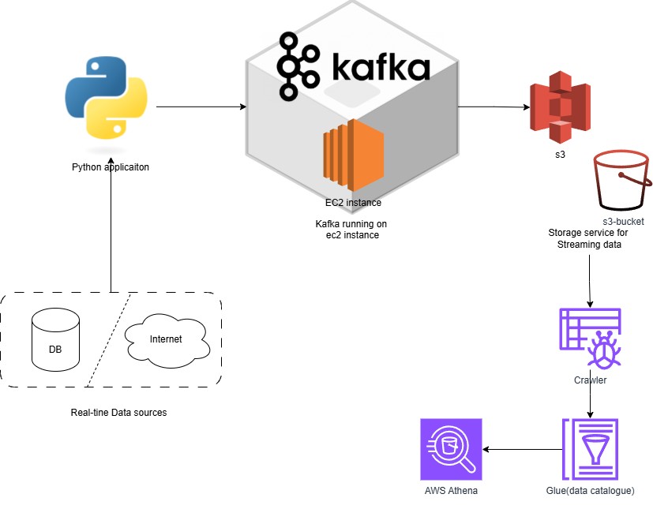
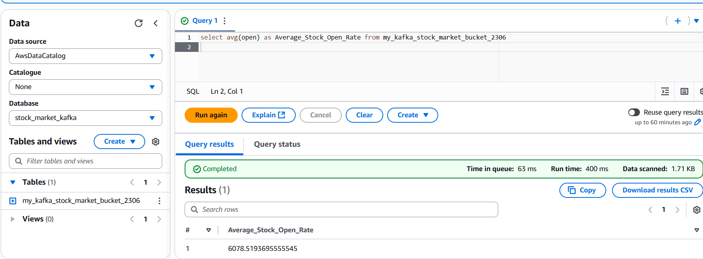

STOCK MARKET REAL-TIME ANALYSIS USING KAFKA & AWS
-

In this project we tried to make an end-to-end data engineering project 

Architecture:
-

Technologies used:
-
1. Python
2. AWS - S3, Athena, Glue Crawler, Glue catalogue, EC2
3. Apache Kafka

Flow:
-
> 1. We deploy an EC2 instance.
> 2. We download and set up the latest Kafka version in the environment of the deployed instance.
> 3. We configure Kafka to run over the public ip of our ec2 instance.
> 4. We make topic to access the real-time streaming data.
> 5. We make a python application in our local env.
> 6. We write code to make a kafka producer in python.
> 7. We write code to make a kafka consumer in python.
> 8. In the producer we fetch the data from API, but for this case to simulate a real-time API, we use pandas to fetch dataset and make sample batches and then send it to kafka
> 9. In the consumer we fetch the data coming from the producer, and then dumps the data into s3 bucket in json format.
> 10. Then we run both producer and consumer, and the data from the consumer is seen in s3 bucket as different data objects.
> 11. Then we set up a Glue crawler over the bucket.
> 12. The Glue crawler examines the data in real-time and saves in a Glue data catalogue, to be used by different AWS services
> 13. Then we can open AWS Athena and connect it to our catalogue
> 14. Using Athena we can run all kinds of analytical queries on this data.

Final Output Analytics(Athena):
-

